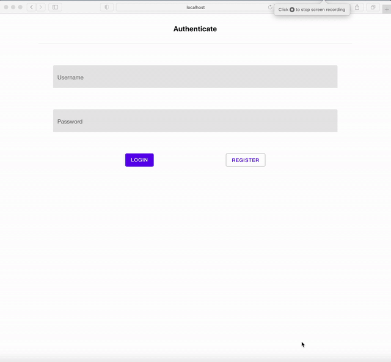
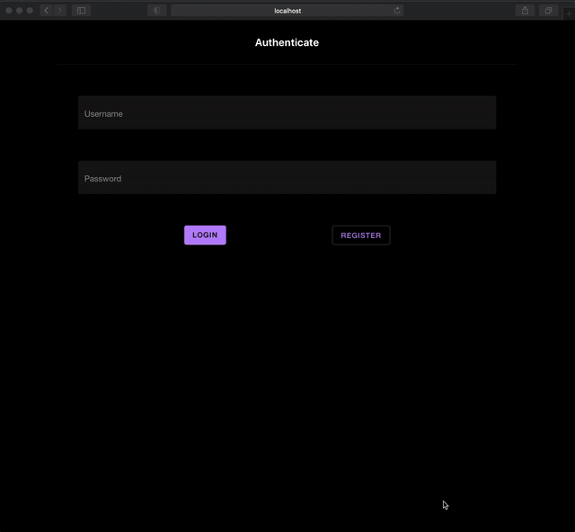

# MERnN Todo app frontend

This runs a [R]eact [n]ative frontend for a 

## Functionalities

Simple Authentication

Create / Delete | **Projects**

Create / Edit / Finish Delete | **Project Tasks**

**Dark mode** based on device settings






## Getting Started

These instructions will get you a copy of the project up and running on your local machine for development and testing purposes. See deployment for notes on how to deploy the project on a live system.

### Prerequisites

 * NODE 10 +
 * yarn
 * Todo app Server

### Installing


Create a .env file 

```
API='http://localhost:3000/'
```

Install dependencies

```
yarn install
```

Run for WEB in development mode:
```
yarn web
```

## Deployment WEB
https://docs.expo.io/workflow/web/

## Creating a Build

- Optimize the assets for speed - `npx expo-optimize` (formerly `expo optimize`)
- Bundle the project for production - `npx expo build:web`
  - Creates a production ready static bundle in the `web-build/` directory. Don't edit this folder directly.
  - Uses Webpack to [optimize the project.][webpack-optimize]
  - If you make any changes to your project, you'll need to re-build for production.
  - For more help use `expo build:web --help`
  - To speed up builds you can skip the PWA asset generation with `expo build:web --no-pwa`
- You can now deploy or host this anywhere you like.

**Tips**

- Serving your site in a subfolder? Add the path to your `package.json`:

```js
/* package.json */
{
    "homepage": "/webapp"
}
``` 

[webpack-optimize]: https://webpack.js.org/configuration/optimization/

### Serving Locally

- [Serve CLI][serve-cli]: Quickly test how it works in production - `npx serve web-build`
- Open [`http://localhost:5000`](http://localhost:5000)
- **This is `http` only, so permissions, camera, location, and many other things won't work.**

[serve-cli]: https://www.npmjs.com/package/serve

---

## Built With

* Expo (React native web)
* react-navigation
* react-native-paper UI
* axios
* Typescript

## Versioning

 [SemVer](http://semver.org/) is used for versioning. 
## Author

* **Filipe Fernandes** - [filipef101](https://github.com/filipef101)

## License

This project is licensed under the AGPL-3.0 License - see the [LICENSE.md](LICENSE.md) file for details
